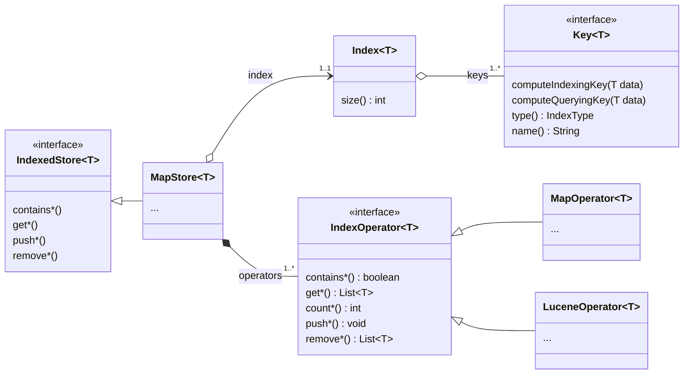

# Indexed Store

Indexed Store is a library providing a simple toolkit for creating composite datastore.

_Note: The library adheres to semver and flags "possibly unstable" APIs as such with an `@Experimental` documented annotation._

## I. Installation

Add the following in your `pom.xml`:

```xml
<dependency>
    <groupId>tech.illuin</groupId>
    <artifactId>indexed-store</artifactId>
    <version>0.5.5</version>
</dependency>
```

## II. Notes on Structure and Design

In `indexed-store`, a datastore is embodied by the `IndexedStore` interface: it is a generic type which argument is the type of the data expected to be stored, with methods for reading, adding and removing data from the store.

There are currently two implementations of the `IndexedStore` contract, `MapStore` and `ConcurrentMapStore`, both being identical in behaviour (the latter simply introduces RRW-locks for read/write operations).

`IndexedStore` implementations are expected to be "composite stores", which we will define here as having a single interface for accessing multiple collections of objects.
The gist of it is that the store will be initialized with a list of indexes that need to managed (defined with the `Key` type), then for each object added to the store it will add it to one or several of these indexes, or eventually drop it if none matched.

Then, when one queries the store, it is expected to provide a list of indexes to match the query against. Each index will be iteratively checked and the first match will be returned to the caller.

Behind the scene, each index `Key` will be managed by an `IndexOperator`, which implementation will determine how exactly the index is implemented.
There are currently two `IndexOperator` implementations:
* `MapOperator` which simply relies on collections of hashmaps
* `LuceneOperator` which can maintain collections of Lucene indexes

The most prominent aspects of the general architecture looks something like this:



## III. Usage


## IV. Dev Installation

This project will require you to have the following:

* Java 17+
* Git (versioning)
* Maven (dependency resolving, publishing and packaging) 
