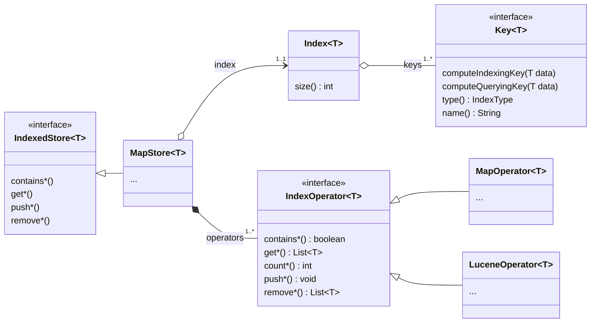

# Indexed Store

Indexed Store is a library providing a simple toolkit for creating composite datastore.

_Note: The library adheres to semver and flags "possibly unstable" APIs as such with an `@Experimental` documented annotation._

## I. Installation

Add the following in your `pom.xml`:

```xml
<dependency>
    <groupId>tech.illuin</groupId>
    <artifactId>indexed-store</artifactId>
    <version>0.7</version>
</dependency>
```

## II. Notes on Structure and Design

In `indexed-store`, a datastore is embodied by the `IndexedStore` interface: it is a generic type which argument is the type of the data expected to be stored, with methods for reading, adding and removing data from the store.

There are currently two implementations of the `IndexedStore` contract, `MapStore` and `ConcurrentMapStore`, both being identical in behaviour (the latter simply introduces RRW-locks for read/write operations).

`IndexedStore` implementations are expected to be "composite stores", which we will define here as having a single interface for accessing multiple collections of objects.
The gist of it is that the store will be initialized with a list of indexes that need to managed (defined with the `Key` type), then for each object added to the store it will add it to one or several of these indexes, or eventually drop it if none matched.

Then, when one queries the store, it is expected to provide a list of indexes to match the query against. Each index will be iteratively checked and the first match will be returned to the caller.

Behind the scene, each index `Key` will be managed by an `IndexOperator`, which implementation will determine how exactly the index is implemented.
There are currently two `IndexOperator` implementations:
* `MapOperator` which simply relies on collections of hashmaps
* `LuceneOperator` which can maintain collections of Lucene indexes

The most prominent aspects of the general architecture looks something like this:



## III. Usage

The workflow when using `indexed-store` looks like this:
* start with the data type you need to index
* define the index keys that will be used to form the store's indexes
* create an `IndexedStore` instance and provide it with the set of indexes to keep track of
* push data to the store instance

Let's say we want a store referencing products, we will define products like this:

```java
public record Product(
    String uid, /* A unique identifier within the system */
    String categoryCode, /* A business-related category code */
    String hsCode, /* A Harmonized System code */
    String name /* A freeform naming string */
) {}
```

We want to be able to query the store by:
* `uid`
* `hsCode` for a given `categoryCode`

In `index-store` terms, this can result in the following two keys:
* `UID_IDX` will be a key for absolute equality of the `uid` property
* `HSCODE_CATEGORY_IDX` will be a key for absolute equality of both the `hsCode` and the `categoryCode` properties
  * note that in this example we use an `_` character as a delimiter, as it currently stand it is up to the implementer to decide on a delimiter that does not clash with the data being manipulated

```java
Key<Product> UID_IDX = Key.of(Product::uid);
Key<Product> HSCODE_CATEGORY_IDX = Key.of(p -> String.join("_", p.hsCode(), p.categoryCode()));
```

Now creating a store is as simple as the following:

```java
Index<Product> index = Index.of(UID_IDX, HSCODE_CATEGORY_IDX);
IndexedStore<Product> store = new MapStore<>(index);

// given the existence of products as a Collection<Product>

store.pushAll(products);
```

And then, querying it:

```java
/* Check whether the store contains an entry for the given uid */
store.contains("6256d417-9685-4211-89e2-db3f0395fd3c", UID_IDX);

/*
 * Composite keys are best queried through the exemplar pattern, using the *Match methods
 * The following will check whether the store contains an entry matching the provided exemplar
 * Note: Using https://github.com/Randgalt/record-builder can help for producing exemplars in a cleaner manner
 */
Product exemplar = new Product(null, "08181000", "fruits", null);
store.containsMatch(exemplar, HSCODE_CATEGORY_IDX);
```

Now let's say we want to introduce an additional way of querying it, we want to query products that:
* match a given `hsCode` and `categoryCode` combination
* if none are available, it should match the first entry based on the `hsCode` only

Adding this behaviour works by first creating a key for the `hsCode`:

```java
Key<Product> HSCODE_IDX = Key.of(Product::hsCode);

/* Obviously, the store initialization now looks like this: */
Index<Product> index = Index.of(UID_IDX, HSCODE_CATEGORY_IDX, HSCODE_IDX);
/* ...rest is the same */
```

And now, querying:

```java
Product exemplar = new Product(null, "08181000", "vegetables", null);
store.containsMatch(exemplar, List.of(HSCODE_CATEGORY_IDX, HSCODE_IDX));
```

The order we provide keys is important: it will determine which index is checked first, and iteratively go through them until one matches.
In the example above, we first check for the combination of both the `hsCode` and `categoryCode`, and if nothing matches, we check for the `hsCode` alone.

This type of behaviour can be leveraged in a variety of ways, with increasingly more permissive indexes.

## IV. Dev Installation

This project will require you to have the following:

* Java 17+
* Git (versioning)
* Maven (dependency resolving, publishing and packaging) 
